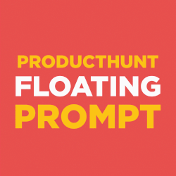

# ProductHunt Floating Prompt 

⚡️ Invite your users to support you on product hunt with this floating prompt (and mobile responsive).

## Demo
Check out the demo in these websites: 
- https://producthuntprompt.learn.uno/
- https://git.news
- https://gitnews.learn.uno
- https://textblast.learn.uno

## How to use
The ProductHunt Floating Prompt is very easy to use, just copy paste the following code or use the npm package.
A few customization such as localstorage to appear only once, color, position are availables check the options below.

### Easy way (using the JSDelivr CDN)
Just add this code to your html page:
```html
<script src="https://cdn.jsdelivr.net/npm/producthunt-floating-prompt/lib/producthunt-floating-prompt.min.js"></script>
<script>
  FloatingPrompt({name:'GitNews', url:'https://www.producthunt.com/posts/gitnews'});
</script>
```

### Using NPM
```sh
npm install producthunt-floating-prompt
```

Then add the following javascript code:
```javascript
import FloatingPrompt from 'producthunt-floating-prompt';

FloatingPrompt({name:'GitNews', url:'https://www.producthunt.com/posts/gitnews'});
```

## Options
Here are the option availables:
```javascript
var options = {
  name: 'My super product',
  url: 'https://www.producthunt.com/posts/my-super-product',
  text: 'My customized text', // default: Hi, do you like ${name} ? Don't forget to show your love on Product Hunt 🚀
  buttonText: 'My customized button', // default: ${name} on Product Hunt
  width: '500px', // default: 300px
  bottom: '32px', // default: 32px - postition from the bottom
  right: 'unset', // default: 32px - position from the right
  left: '32px', // default: unset - position from the left
  colorOne: 'red', // default: #da552f - first color of the gradient
  colorTwo: 'blue', // default: #ea8e39 - second color of the gradient
  saveInCookies: false // default: true - if true it will use localStorage to appear only once
}

FloatingPrompt(options);
```

## Development

* `yarn build` or `npm run build` - produces production version of your library under the `lib` folder
* `yarn dev` or `npm run dev` - produces development version of your library and runs a watcher
* `yarn test` or `npm run test` - it runs the tests :)
* `yarn test:watch` or `npm run test:watch` - same as above but in a watch mode

## Buy me a beer
If you like this project, feel free to donate:
* Paypal: https://www.paypal.me/kanbanote
* Bitcoin: 19JiNZ1LkMaz57tewqJaTg2hQWH4RgW4Yp
* Ethereum: 0xded81fa4624e05339924355fe3504ba9587d5419
* Monero: 43jqzMquW2q989UKSrB2YbeffhmJhbYb2Yxu289bv7pLRh4xVgMKj5yTd52iL6x1dvCYs9ERg5biHYxMjGkpSTs6S2jMyJn
* Motive: MOTIV-25T5-SD65-V7LJ-BBWRD (Get Motive Now: https://motive.network)